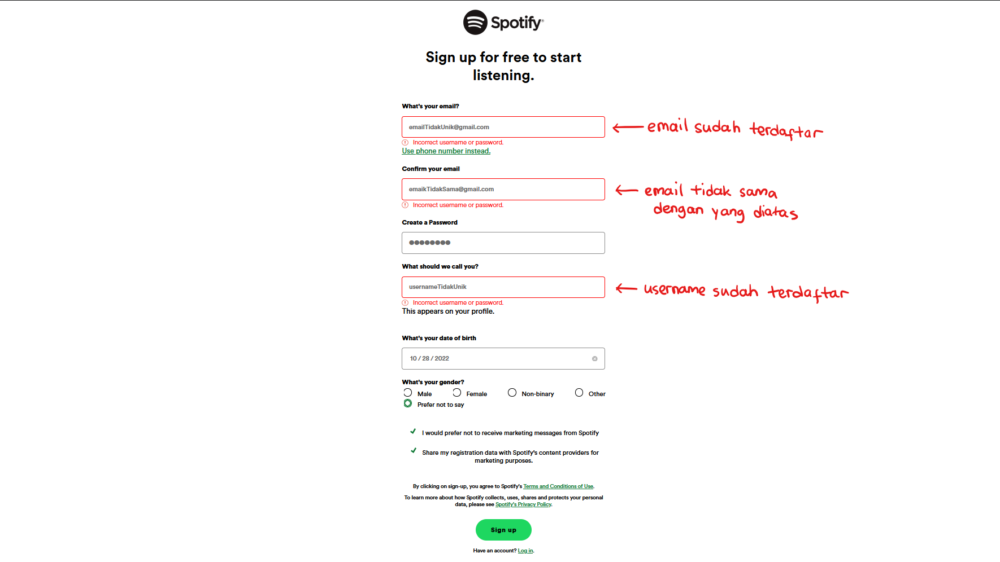

<a name="readme-top"></a>
<br />
<div align="center">
  <a href="https://gitlab.informatika.org/if3110-2022-k01-02-32/ngnotify-premium-app">
    
  </a>

  <h3 align="center">Ngnotify Premium App</h3>

  <p align="center">
    :indonesia: Platform Subscription Lagu Karya Anak Bangsa :indonesia:<br>
    Penantang Search Engine Gatot Kaca Sebagai Karya Terbaik Anak Bangsa
</div>


<!-- TABLE OF CONTENTS -->
<details>
  <summary>Table of Contents</summary>
  <ol>
    <li>
      <a href="#about-the-project">About The Project</a>
      <ul>
        <li><a href="#built-with">Built With</a></li>
      </ul>
    </li>
    <li>
      <a href="#getting-started">Getting Started</a>
      <ul>
        <li><a href="#dependencies">Dependencies</a></li>
        <li><a href="#prerequisites">Prerequisites</a></li>
        <li><a href="#installation">Installation</a></li>
      </ul>
    </li>
    <li><a href="#usage">Usage</a></li>
    <li><a href="#contributions">Contributions</a></li>
    <li><a href="#contact">Contact</a></li>
  </ol>
</details>


<!-- ABOUT THE PROJECT -->
## About The Project

Ngnotify Premium adalah sebuah web app khusus untuk para penyanyi yang ingin ~memonetize~ menampilkan lagu premium pada ngnotify app. Web app ini dibuat untuk memenuhi ~Tugas Besar 2 IF3110 Teknik Informatika ITB~ panggilan negara untuk mencintai produk karya anak bangsa. Karena itu, kami membuat sebuah produk lokal agar terdapat produk Indonesia untuk dicintai :heart:heart:heart

Sebagai pembantu Ngnotify app dalam menyaingi  Search Engine Gatot Kaca untuk gelar aplikasi anak bangsa terbaik, Ngnotify Premium memiliki fitur yang sangat ~tidak~ lengkap. Ngnotify Premium memiliki fitur login, register, add edit delete lagu, accept dan reject subscription (khusus admin), dan..... kayanya itu aja sih.

<p align="right">(<a href="#readme-top">back to top</a>)</p>


### Built With

* vite
* React
* Typescript

<p align="right">(<a href="#readme-top">back to top</a>)</p>


<!-- GETTING STARTED -->
## Getting Started

Tanpa Berlama-lama inilah cara menjalankan web app

### Dependencies
Agar Program dapat berjalan dengan baik, silahkan install juga repo-repo berikut:

```
https://gitlab.informatika.org/if3110-2022-k01-02-32/ngnotify-app
```
```
https://gitlab.informatika.org/if3110-2022-k01-02-32/ngnotify-rest-service
```
```
https://gitlab.informatika.org/if3110-2022-k01-02-32/ngnotify-soap-service
```

### Prerequisites

* Docker
    ```sh
    https://www.docker.com/
    ```
* Git
    ```sh
    https://git-scm.com/downloads
    ```
* NPM
    ```sh
    https://www.npmjs.com/get-npm
    ```
* Internet (karena Database online)
* Kesabaran (karena akses data sering kali lemot - <i>maklum gratis</i>)

### Installation


1. Clone Repo ini dengan menggunakan cmd pada directory yang diinginkan
    ```sh
    C:\Users\MerekLaptop> 
    git clone https://gitlab.informatika.org/if3110-2022-k01-02-32/ngnotify-premium-app
    ```
2. Buka Directory tempat file di clone
   ```sh
   C:\Users\MerekLaptop> cd ngnotify-premium-app
   C:\Users\MerekLaptop\ngnotify-premium-app>
   ```
3. CARA 1 MELALUI DOCKER: Jalankan docker 
   ```sh
   C:\Users\MerekLaptop\ngnotify-premium-app>
   docker-compose up -d
   ```
   CARA 2 MELALUI LOCAL: Jalankan npm
   ```sh
    C:\Users\MerekLaptop\ngnotify-premium-app>
    npm install
    npm run dev
    ```

4. buka http://localhost:3010 di ~chrome~ browser favorit kalian
5. Ngnotify Premium siap untuk dipakai secara terbatas 
6. Untuk menggunakan seluruh layanan web, jalankan seluruh (<a href="#dependencies">dependencies</a>) yang ada
7. Jika dependencies sudah dijalankan, Ngnotify Premium siap untuk dipakai secara full :smile:
<p align="right">(<a href="#readme-top">back to top</a>)</p>

<!-- USAGE EXAMPLES -->
## Usage

1. Login


2. Register



3. Manage Song


4. Add Song


5. Edit Song


6. Manage Subscription


<p align="right">(<a href="#readme-top">back to top</a>)</p>

<!-- CONTRIBUTING -->
## Contributions
|feature|13520019|13520034|13520040|
|-------|--------|--------|--------|
|AddSong|:heavy_check_mark:|:heavy_check_mark:|:heavy_check_mark:|
|EditSong|:heavy_check_mark:|:heavy_check_mark:|:heavy_check_mark:|
|ListSubscription|:heavy_check_mark:|heavy_check_mark|:heavy_check_mark:|
|Login|:heavy_check_mark:|heavy_check_mark|:heavy_check_mark:|
|ManageSong|:heavy_check_mark:|:heavy_check_mark:|heavy_check_mark|heavy_check_mark|
|Register|:heavy_check_mark:|:heavy_check_mark:||
|Reusable|:heavy_check_mark:|||
|Docker||:heavy_check_mark:|:heavy_check_mark:|


<p align="right">(<a href="#readme-top">back to top</a>)</p>


<!-- LICENSE -->
## License

Distributed under the NG License. See you again for more information.

<p align="right">(<a href="#readme-top">back to top</a>)</p>


<!-- CONTACT -->
## Contact
|Name|Contact|Github|
|----|-------|------|
|Maharani Ayu Putri Irawan | 13520019@std.stei.itb.ac.id| <a href="https://www.github.com/rannnayy">@rannnayy</a>|
|Bryan Bernigen | 13520034@std.stei.itb.ac.id |<a href="https://www.github.com/Nk-Kyle">@Nk-Kyle</a>|
|Ng Kyle | 13520040@std.stei.itb.ac.id|<a href="https://www.github.com/bryanbernigen">@bryanbernigen</a>|

<p align="right">(<a href="#readme-top">back to top</a>)</p>
